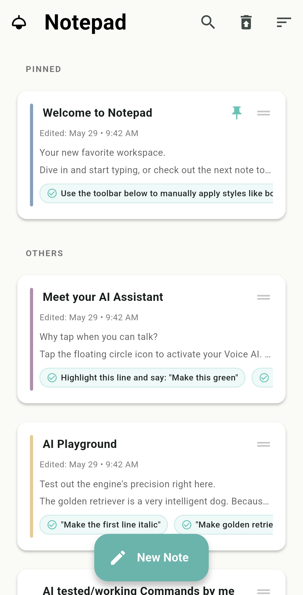
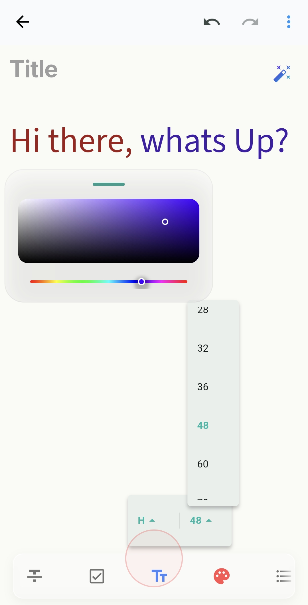
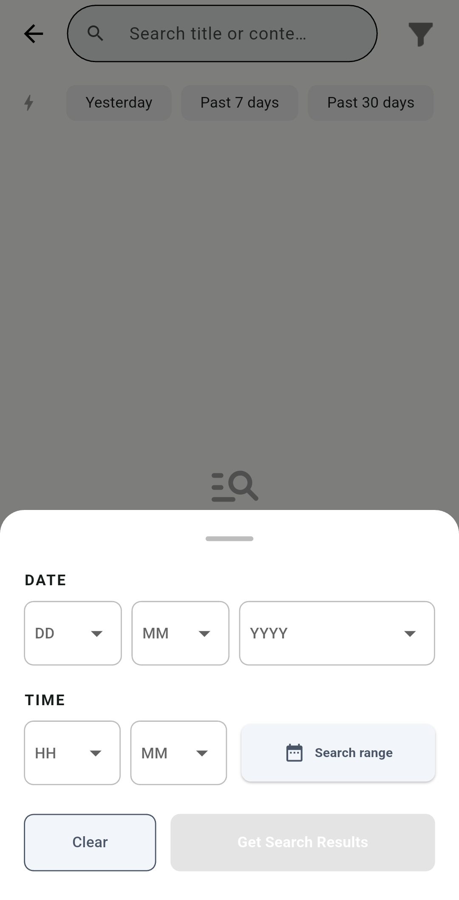
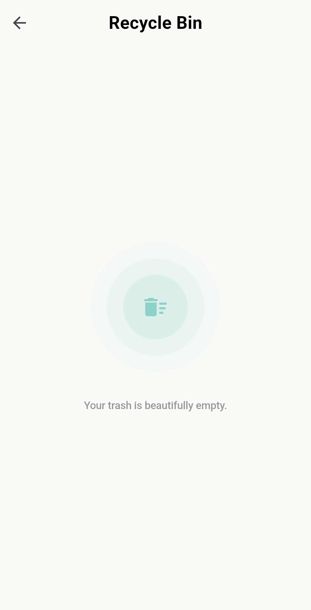

# 📝 Notepad

Hey there! 👋 Welcome to **Notepad**, a polished, buttery-smooth, and local-first Flutter notes app built around fast writing, structured organization, and reliable data handling.

Notepad combines a clean, distraction-free editor experience with practical everyday features. Whether you are typing away, using voice-assisted commands, or syncing your encrypted notes to Google Drive, the app is designed to feel fast, completely dependable, and tailored to your workflow.

<p align="center">
   
  
  
  
</p>

---
## 📥 Download

[📱 Download Latest APK](https://github.com/SayanMz/notepad-app/releases/latest)

---

# Feature Highlights ✨

A comprehensive overview of the application's capabilities. 🚀

## Core Features 🛠️

* **Rich-Text Editing:** Create notes with headers, bold styling, hyperlinks, and interactive bullet lists (powered by `flutter_quill`).
* **Groq LLM Voice Engine:** Voice-assisted command processing. Dictate commands like *"Underline the second instance of dog"* or *"Make the first line green"* to trigger real-time AI document transformations.
* **Dynamic Full-Text Search:** Instantly locate precise keywords across your entire library with real-time text highlighting inside note previews and useful empty states.
* **Safe Soft-Deletion:** Accidental deletes drop safely into a dedicated Recycle Bin for single-tap restorations or permanent wipes.
* **Google Drive Integration:** Authenticate securely via OAuth 2.0 to push secure database backups directly to your cloud tier on-demand.

## Operational & User Experience Features ⚙️

* **Autosave:** Reliable background saving with clear save-status feedback.
* **Organization:** Tools for pinning, reordering, color updates, and bulk selection of notes.
* **Security & Privacy:** Encrypted local storage ensures your data remains private.
* **Flexibility:** Export and share support to easily move your data.
* **Customization:** Theme switching to adjust the look and feel of the app.

---

## 🧠 Engineering & Architecture 
The app doesn't just look clean; it's built to be highly optimized, maintainable, and production-ready underneath. The codebase uses a **Feature-First** structure alongside a strict controller/service/repository split.

### Structural Breakdown
- `core/` - Startup logic, persistence, theming, constants, reusable helpers, and shared services.
- `features/home/` - Orchestrates the main notes dashboard, selection mode, bulk actions, sync entry points
- `features/note/` - Houses the editor, toolbar, voice AI integration, and export logic.
- `features/filter/` - Handles search, query states, and filtering UI.
- `features/trash/` - Manages deleted-note recovery and permanent purging.

### Design
- Clear separation between UI, controllers, repositories, and services
- Feature-level controllers that coordinate state without overloading widgets
- Shared utilities in `core` for startup, storage, theme, and reusable app behavior
- Encrypted persistence with Hive and secure key storage
- Search backed by local indexing and note metadata
- Reusable UI helpers for consistent spacing, motion, and styling

---

## 🎯 Why This App Exists

There are a million notes apps out there, but this project was built specifically to tackle the real complexity underneath a deceptively simple surface. The goal was an app tailored for folks who believe:
- Notes should be easy to create, seamlessly supporting both typing and voice-driven interactions.
- Search must be instantaneous and actually useful.
- Deletion should be reversible and safe.
- Storage must be reliable, encrypted, and private.
- Syncing and backups (like Google Drive) should feel optional, not forced.

---
### 🎬 Full Application Walkthrough

[Watch Walkthrough Video](https://github.com/SayanMz/notepad-app/releases/download/v2.0.0/Notepad.2.0.mp4)

---

## 🛠️ Tech Stack & Architecture

Click the sections below to see the architectural details of how these systems are integrated:

<details>
<summary><b>🤖 AI Core Pipeline (Speech-to-Text-to-LLM)</b></summary>

- `speech_to_text`: Local microphone hardware stream processing for automated voice transcription.
- `Groq LLM API Integration`: Cloud-hosted LLM orchestration. Maps localized semantic voice commands into structured document state mutations via secure REST API endpoints.
- `flutter_tts`: Real-time synthesized auditory speech responses leveraging forced target high-quality hardware voices.
</details>

<details>
<summary><b>💾 Data Architecture (Hybrid Local Storage Engine)</b></summary>

- `sqflite` & `sqlite3_flutter_libs`: Relational storage engine powering a **Hybrid Search Pipeline**. 
  - *Stage 1:* Virtual FTS (Full-Text Search) tables perform high-speed keyword pruning to return a candidate ID set.
  - *Stage 2:* In-memory Dart collection filtering (via `note_search_service.dart`) applies complex business logic constraints like date-range boundaries and active/deleted visibility states.
- `hive` & `hive_flutter`: Low-latency NoSQL key-value cache layer managing live operational document trees.
</details>

<details>
<summary><b>🔒 Security & Ecosystem Bridges</b></summary>

- `flutter_secure_storage`: Hardware-isolated keychain encryption for storage of persistent cloud auth tokens.
- `google_sign_in` & `googleapis`: OAuth 2.0 workflow handling for secure Google Drive binary state synchronization.
- `flutter_quill`: Advanced text mutation management using incremental delta arrays.
- `share_plus` & `url_launcher`: Native system tray share sheets and protocol intent handlers.
</details>

---

## 🚀 Local Setup

<details>
<summary><b>Show Installation Commands</b></summary>

### Prerequisites
- [Flutter SDK](https://docs.flutter.dev/get-started/install) (Version 3.0+)
- Dart SDK
- A configured `.env` file containing your required Google API keys (for Drive Sync and Voice AI features).

### Installation & Run

1. Clone the repo and install the packages:
```bash
flutter pub get
```

2. Spin up the code-generation engine for your local TypeAdapters:
```bash
flutter pub run build_runner build --delete-conflicting-outputs
```

3. Run the app:
```bash
flutter run
```

*(Want to run it on a specific platform? Use `flutter run -d windows` or `flutter run -d android`)*
