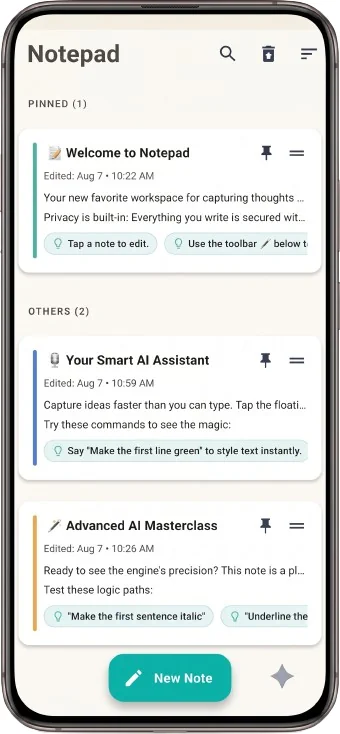
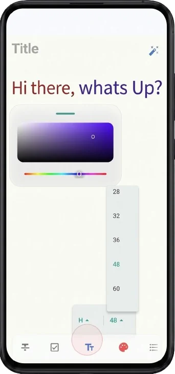
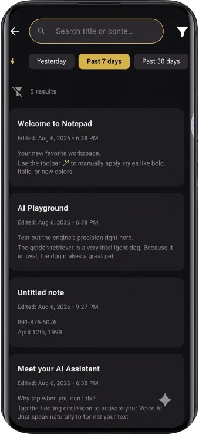
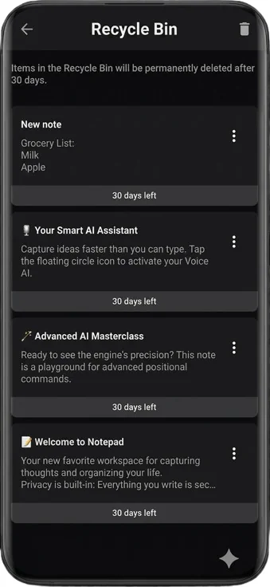

# 📝 Notepad

**Notepad** is a sophisticated, local-first workspace engineered to dissolve the friction between thought and digital record. Blending high-performance SQLite FTS power with advanced Groq AI integration, it transforms a minimalist interface into a secure, intelligent thinking partner. Every interaction is tuned for near-instant responsiveness, ensuring your focus remains entirely on your ideas.

   
   
   
   

---
## 📥 Download
[📱 Download Latest APK](https://github.com/SayanMz/notepad-app/releases/latest)

---
# Core Pillars 🚀

### 🧠 Intelligence & Search
* **Smart AI Assistant:** Execute hands-free commands and dictate thoughts via high-speed Groq AI integration. Transform documents in real-time with natural commands like *"Make the first line green"* or *"Underline all instances of 'Notepad'"*.
* **Lightning-Fast Search:** Locate precise keywords instantly using a local SQLite FTS (Full-Text Search) engine. Features real-time text highlighting and smart date-range filtering.
* **Intelligent Auto-Save:** Every stroke is captured in real-time with zero latency, backed by visual save-status indicators.

### 🔒 Uncompromising Privacy & Safety
* **Privacy-First Design:** Your data is your business. Every note is secured on-device using local, high-security hardware-backed encryption (AES-256).
* **Secure Cloud Backup:** Never lose a moment of inspiration. Authenticate safely to sync encrypted database backups directly to your personal Google Drive storage on-demand.
* **Managed Recycle Bin:** A robust safety net to recover accidental deletions or perform permanent data purging from a dedicated bin.

### ✨ Premium Productive Experience
* **Professional Editor:** A highly responsive rich-text engine supporting headers, styles, hyperlinks, and interactive bullet lists.
* **Smart Organization:** Power-user multi-select tools for batch pinning, sharing, or deleting, plus a bespoke draggable color picker interface for workspace personalization.
* **Modern Design System:** AMOLED-optimized dark mode, adaptive grid layouts for tablets, and silky-smooth cross-fade transitions powered by a central Design Token engine.

---

## 🏗️ Engineering & Tech Stack 

Notepad is built on a **Feature-First** architecture with a strict **Controller-Service-Repository** pattern, ensuring the app is highly optimized, testable, and production-ready.

- **Decoupled Logic**: Separation into distinct layers (UI → Controller → Service → Repository) for maximum modularity.
- **Robust Test Coverage**: Supported by a comprehensive suite of **140+ automated tests** utilizing Dependency Injection to ensure 100% logic reliability.
- **Hybrid Data Layer**: High-speed **Hive (NoSQL)** for live document state combined with **SQLite (Relational)** for complex full-text indexing.
- **Data Integrity**: Uses **ULID-based identifiers** for consistent lexicographical ordering and reliable local-to-cloud synchronization.
- **Semantic Theming**: Unified `Tokens` engine and `context_extensions` for instant, type-safe UI consistency across the entire app.

<b>View Detailed Package Breakdown</b>

- **AI**: `speech_to_text`, `Groq Cloud API`, `flutter_tts`
- **Data**: `sqflite` (FTS Engine), `hive_flutter`, `ulid`
- **Security**: `flutter_secure_storage`, `googleapis` (Drive Sync)
- **UI & PDF**: `flutter_quill`, `pdf`, `printing`, `flutter_colorpicker`, `lottie`, `share_plus`

---
### 🎬 Application Walkthrough
[Watch Walkthrough Video](https://github.com/SayanMz/notepad-app/releases/download/v2.0.0/Notepad.2.0.mp4)

---
## 🚀 Local Setup

<b>Show Installation Commands</b>

### Prerequisites
- **Flutter SDK**: ^3.24.0 (Latest Stable)
- **Dart SDK**: ^3.5.0
- A configured `.env` file containing required Google API keys.

### Installation
1. `flutter pub get`
2. `dart run build_runner build --delete-conflicting-outputs` (Generates Hive adapters)
3. `flutter run`

---

## 📜 License

This project is licensed under the **MIT License** - see the [LICENSE](LICENSE) file for details.

## 👤 Author

Developed with ❤️ by **Sayan Mazumder**
